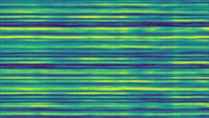
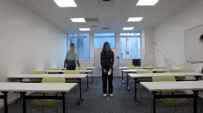
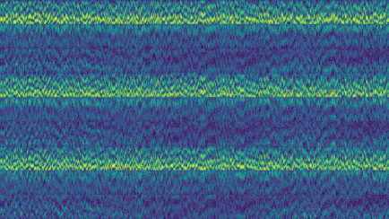
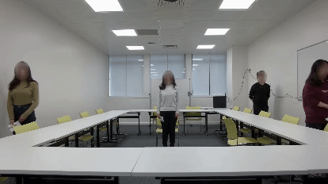
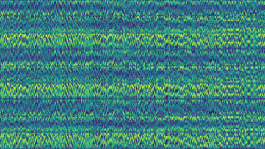
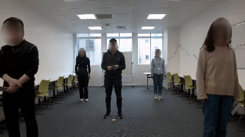

### 🤫  WiFi isn’t just for *"surfing reels"* or *"attending classes"*.

It listens. It reflects. It remembers.

Every *step you take*, *every breath*, *every stillness* — the signals change.
And hidden in those ripples of **WiFi Channel State Information (CSI)** and really its more than just data.

### 😈

It can also… sense your soul.

## “Diwaro ke bhi kaan hote hai.” ❤️

--
*didn't beleive? Wait for a month...*

See a glimpse. tabtak.

<table align = "center">
  <tr align = "center"><td>WiFi CSI (5GHz)</td> <td>Original Footage</td></tr>
  <tr align = "center"><td></td><td></td></tr>
</table>

<table align = "center">
  <tr align = "center"><td>WiFi CSI (2.4GHz)</td> <td>Original Footage</td></tr>
  <tr align = "center"><td></td><td></td></tr>
</table>

<table align = "center">
  <tr align = "center"><td>WiFi CSI (2.4GHz)</td> <td>Original Footage</td></tr>
  <tr align = "center"><td></td><td></td></tr>
</table>
